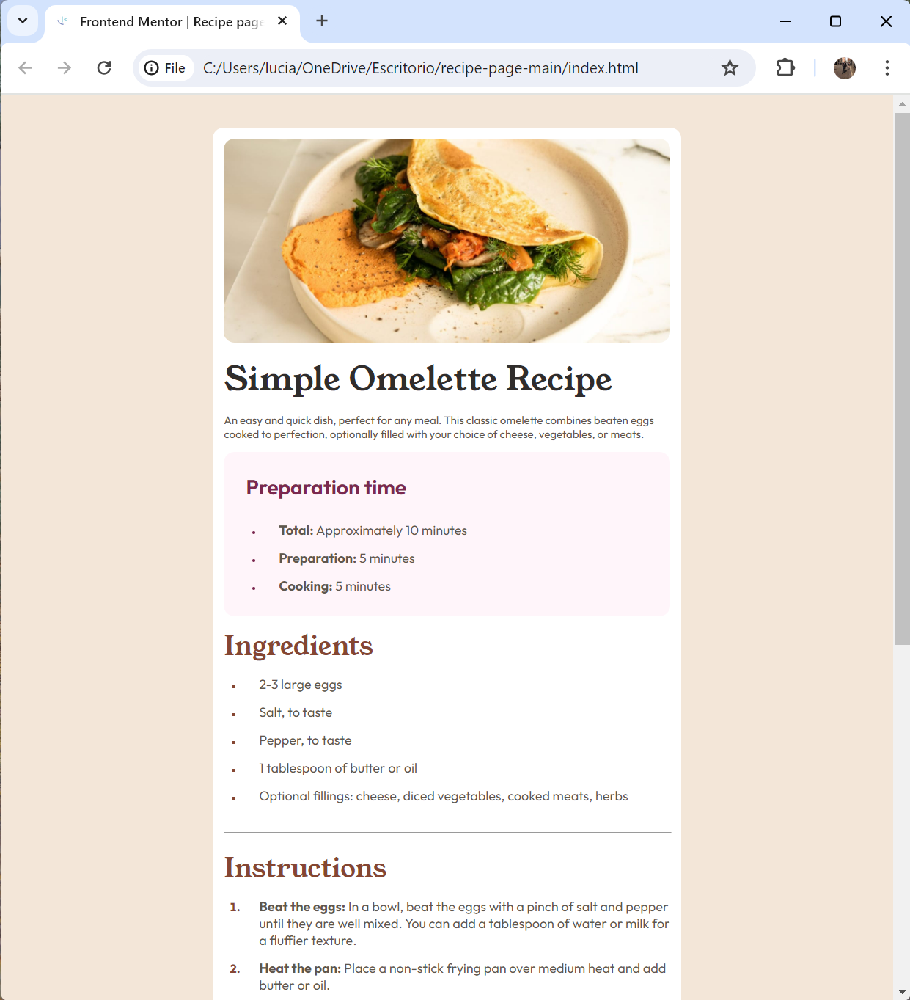
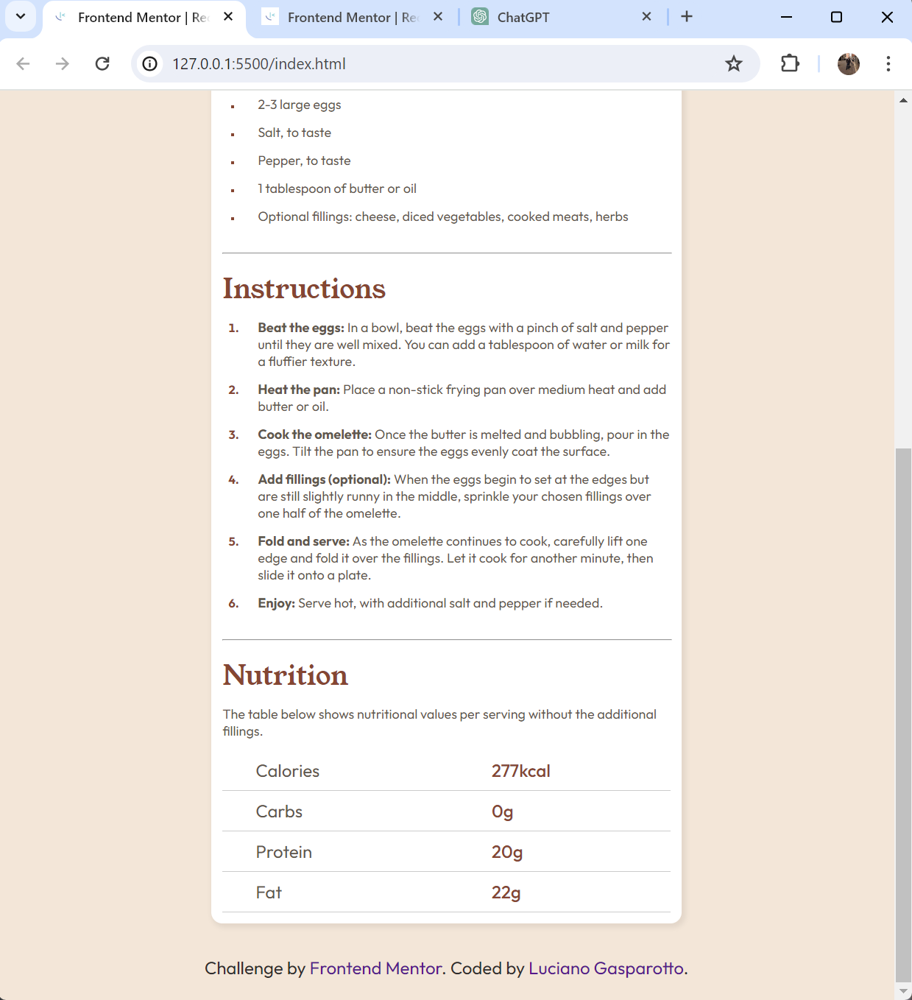

# Frontend Mentor - Recipe page solution

## Overview

### Screenshot

## My process

### Built with

- Semantic HTML5 markup
- CSS custom properties
- Flexbox
- Mobile-first workflow
- VS Code

### What I learned

"This was the first challenge I did without looking at someone and copying everything they wrote. It was a bit challenging due to the short time I've been studying, but I think it turned out well for a first time. I don't have any specific questions to ask the community, but I would like you to comment, criticize, even to correct."
### Continued development

"I'm focused on frontend development and I know I have a lot to learn, and any suggestions please don't hesitate to leave them, your experience would be of great help."

### Useful resources

"As mentioned above, I didn't use any video tutorials or anything like that, just the help of ChatGPT as if it were a teacher by my side answering my questions and getting about 70% of them wrong, hahaha."

## Author

- Frontend Mentor - [lucianogasparotto](https://www.frontendmentor.io/homee)
- Twitter - [@gasparottolive](https://twitter.com/home)